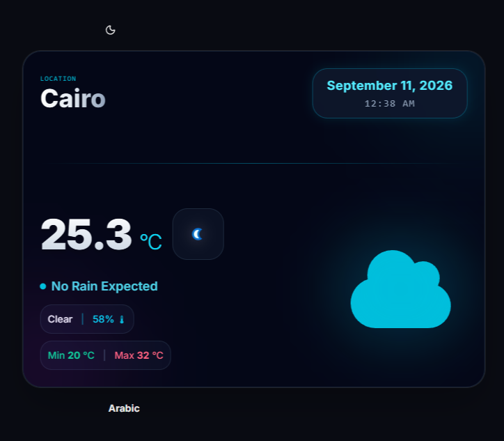
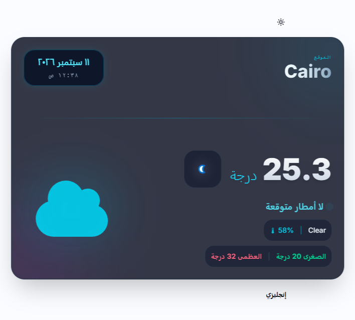

# 🌤️ Weather App

A clean, minimal weather app built with **React**, **TypeScript**, and **Vite** — real-time weather for any location, with full Arabic/English localization and dark/light theme support.

  
  
  
  
  

🔗 **[Live Demo](https://weather-app-project-fmvn-eta.vercel.app/)**

---

## 🖼️ Preview

  
  

---

## ✨ Features

- 📍 **Live weather data** — current temperature, condition icon, and description
- 🌡️ **Min / Max temperatures** and humidity at a glance
- 🌙 **Dark / Light mode toggle**
- 🌍 **Arabic / English language toggle** with full RTL support for Arabic (via i18next)
- 🗓️ **Localized date & time**, formatted per selected language
- ☁️ **Condition-based icons** (clear, cloudy, rain, etc.)
- ⚡ **Redux Toolkit** — async data fetching with `createAsyncThunk`, loading/error/success states tracked in a typed slice

---

## 🛠 Tech Stack

| Category | Technology |
|---|---|
| Framework | React |
| Language | TypeScript |
| Build Tool | Vite |
| State Management | Redux Toolkit |
| Styling | Tailwind CSS |
| Localization | i18next (Arabic / English) |
| Weather Data | [WeatherAPI.com](https://www.weatherapi.com/) |

---

## 📂 Project Structure

\`\`\`
weather-app-project/
└── frontend/
    ├── src/
    │   ├── components/     # Weather card, toggles, icons
    │   ├── features/        # Redux slices (weatherSlice, etc.)
    │   ├── Interfaces/       # TypeScript types (WeatherData, etc.)
    │   ├── i18n/              # Arabic / English translations
    │   ├── App.tsx
    │   └── main.tsx
    └── .env.example
\`\`\`

---

## 🚀 Getting Started

### Prerequisites
- Node.js (LTS)
- A [WeatherAPI.com](https://www.weatherapi.com/) API key

### Setup
\`\`\`bash
git clone https://github.com/MAHMOOODD/weather-app-project.git
cd weather-app-project/frontend
npm install
cp .env.example .env   # add VITE_WEATHER_API_KEY=your_key_here
npm run dev
\`\`\`

The app runs at \`http://localhost:5173\` by default.

---

## 🗺 Roadmap

- [ ] 5-day forecast view
- [ ] Search by city name
- [ ] Save favorite locations

---

## 👤 Author

**Mahmoud Salah** — Computer Science student, Cairo University, focused on full stack development.

---

© 2026 Mahmoud Salah. All rights reserved.
